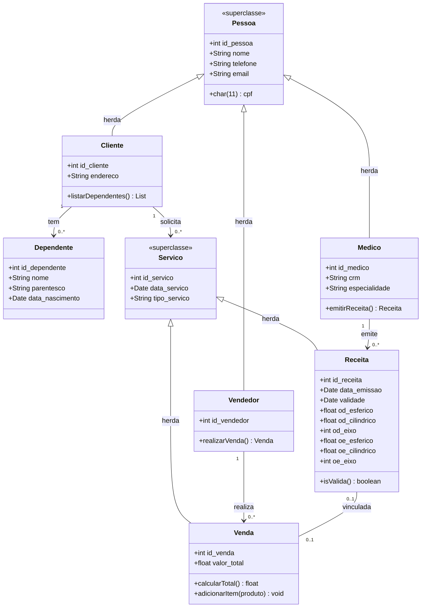
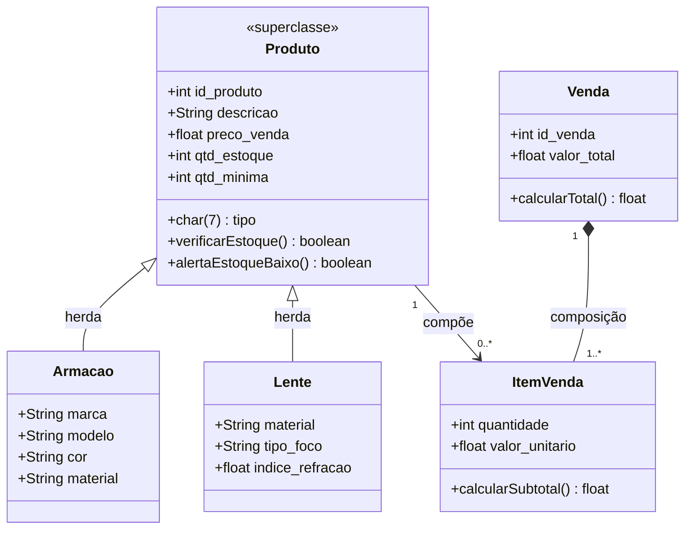
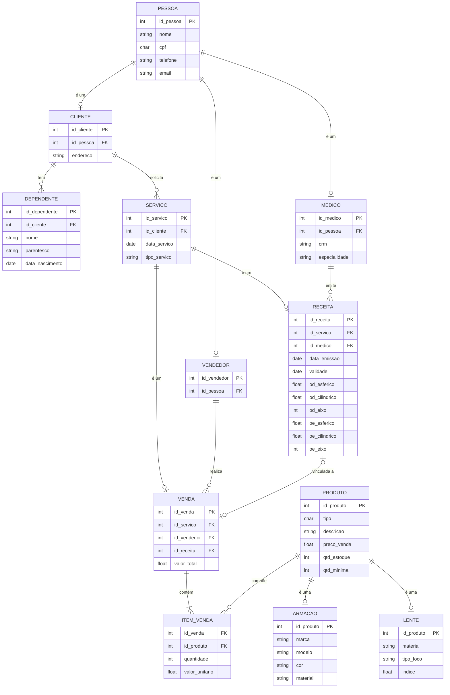

# Ótica Mais — Sistema de Gestão (POO + PostgreSQL)

Trabalho prático desenvolvido para a disciplina de Programação Orientada a Objetos, do curso de Sistemas de Informação (ICET / UFAM).

## Integrantes

- Felipe Rangel
- Iasmim Braga

## Descrição do Sistema

Sistema de gestão para uma ótica, desenvolvido estritamente em **Python puro** com **Programação Orientada a Objetos (POO)** e persistência em **PostgreSQL** (via módulo `psycopg2`).

O domínio reaproveita o modelo conceitual da disciplina de Banco de Dados I, mas foi elevado a uma arquitetura avançada de engenharia de software para mapear heranças lógicas em tabelas físicas normalizadas.

### 1. Modelagem Orientada a Objetos e Polimorfismo

| Conceito POO | Aplicação no Sistema |
| :--- | :--- |
| **Classes de Domínio** | Entidades rigorosamente definidas: `Cliente`, `Medico`, `Vendedor`, `Armacao`, `Lente`, `Receita`, `Venda`, `ItemVenda` e `Dependente`. |
| **Encapsulamento** | Atributos internos protegidos (`__atributo`) e geridos de forma segura com decoradores `@property` e `@setter` em `Pessoa`, `Cliente`, `Produto` e `Venda`. |
| **Herança e Abstração** | Superclasses abstratas (`ABC` com `@abstractmethod`): `Pessoa` (pai de `Cliente`, `Medico`, `Vendedor`) e `Produto` (pai de `Armacao`, `Lente`). |
| **Polimorfismo Real** | Métodos `apresentar()` e `detalhar_produto()`. A interface chama a classe pai, mas o comportamento altera dinamicamente dependendo da subclasse instanciada em tempo de execução. |
| **Tratamento de Exceções** | Exceções customizadas como `VendaSemItensError` e `CpfDuplicadoError`, garantindo as regras de negócio antes de atingir o banco. |

### 2. Banco de Dados e Mapeamento Objeto-Relacional

O script de DDL (`database/schema.sql`) reflete os objetos em memória utilizando relacionamentos avançados:

- **Especialização de Tabelas (1:1):** As heranças do Python foram mapeadas para o banco. A tabela genérica `PESSOA` contém restrições `UNIQUE (id_pessoa)` nas chaves estrangeiras das tabelas `CLIENTE`, `MEDICO` e `VENDEDOR`.
- **Composição (1:N):** Relação em que o `CLIENTE` possui a entidade fraca `DEPENDENTE`.
- **Triggers Funcionais:** O cálculo do `valor_total` da venda e a baixa de estoque na tabela `PRODUTO` são orquestrados de forma autônoma pelo PostgreSQL através da trigger `trg_item_venda_after`.

---

## Diagramas Arquiteturais do Sistema

Os diagramas abaixo foram modelados utilizando a sintaxe Mermaid e são renderizados nativamente pela plataforma do GitHub.

### 1. Diagrama de Classes — Pessoas e Serviços (UML)



### 2. Diagrama de Classes — Catálogo de Produtos (UML)



### 3. Diagrama Entidade-Relacionamento (DER Modelo Físico)



---

## Estrutura e Organização de Pacotes

A arquitetura respeita a separação de responsabilidades (SoC) exigida, isolando a interface gráfica da manipulação de dados:

```
otica_mais_projeto/
│
├── main.py              → Inicializador e boot automático do banco
├── requirements.txt
│
├── database/            → db_connection.py (Conexão via psycopg2) e schema.sql
├── models/              → Classes POO de domínio (Entidades, Heranças e Contratos ABC)
├── repositories/        → Isolamento do SQL puro e transações com o SGBD
├── services/            → Processamento de regras de negócio e validações
└── ui/                  → Interface e menus textuais para o terminal iterativo
```

---

## Instruções de Execução

O sistema foi programado com uma rotina de boot inteligente que constrói o banco de dados e as tabelas automaticamente na primeira execução. Para rodar localmente:

1. **Preparar o SGBD**: Abra o pgAdmin (ou SGBD da sua preferência) e crie um banco de dados vazio com o nome exato de `otica_mais`.
   > ⚠️ **Atenção:** Caso já possua uma versão antiga deste banco, faça o Drop/Delete e recrie para garantir a aplicação da nova estrutura normalizada.

2. **Configurar Credenciais**: Edite o ficheiro `database/db_connection.py` e insira a palavra-passe do seu servidor PostgreSQL local.

3. **Instalar Dependências**: No terminal integrado, ative o seu ambiente virtual (se aplicável) e instale o driver:

   ```bash
   pip install -r requirements.txt
   ```

4. **Iniciar o Sistema**: Execute o ficheiro raiz na raiz do projeto:

   ```bash
   python main.py
   ```

   *(O sistema irá injetar as tabelas no banco de forma silenciosa e exibir o menu interativo imediatamente a seguir.)*
